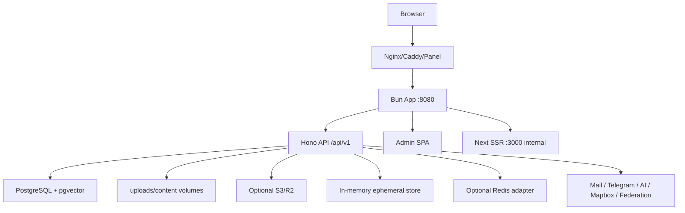

# Utterlog Bun Architecture Review

## 1. 需求与 MVP 摘要

目标是将 Utterlog 从 Go API + Redis + PostgreSQL + Next + Vite Admin 迁移为 Bun/TypeScript API + PostgreSQL + Next SSR + Vite Admin，并以单 app 容器加 PostgreSQL 为默认部署形态。Redis 不再是必需服务，后续仅作为可选 adapter。

MVP 必须保留安装、认证、内容、评论、媒体、主题、插件、统计、AI、同步、备份、联邦和管理端核心功能。暂不强制合并 Admin 到 Next，不引入 Kubernetes，不迁移 SQLite。

## 2. 系统架构拓扑



## 3. 数据库模式

当前 schema 来源为 `app/server/assets/schema.sql` 加 `app/server/src/db/client.ts` 的运行期补充迁移。核心表覆盖 users/passkeys/posts/metas/comments/media/albums/ai/sync/federation/security/access logs/options。目标状态应统一迁移体系，保留 PostgreSQL 的 JSONB、GIN、HNSW、pgvector、RETURNING、ON CONFLICT。

后续必须把 `runCoreMigrations()` 中新增表合并进正式 migration 文件，并给迁移记录补 `checksum/applied_at/duration_ms/dirty`。

## 4. 标准 API 端点文档

统一响应：

```json
{ "success": true, "data": {}, "meta": { "request_id": "uuid", "timestamp": "iso" } }
```

统一错误：

```json
{ "success": false, "error": { "code": "UNAUTHORIZED", "message": "..." }, "meta": { "request_id": "uuid", "timestamp": "iso" } }
```

高层端点分组：

- `/api/v1/setup/*`, `/api/v1/install/*`: 安装期公开，安装后锁定。
- `/api/v1/auth/*`: 登录、刷新、重置公开；账号操作需鉴权。
- `/api/v1/posts`, `/api/v1/categories`, `/api/v1/tags`, `/api/v1/comments`: 公开读，写操作默认管理员。
- `/api/v1/admin/*`: 管理员。
- `/api/v1/media/*`, `/api/v1/themes/*`, `/api/v1/plugins/*`: 管理员。
- `/api/v1/ai/*`: 默认管理员；reader-chat 公开但限流。
- `/api/v1/sync/*`: 插件 token。
- `/api/v1/federation/*`: 公开握手 + token 签名。

## 5. 前端 UI 组件架构

`app/web` 负责前台 SSR 与主题渲染，`app/admin` 负责 Vite React 管理端。短期保留两套前端，同 app 容器部署；长期可将 Admin 收敛为 Next route group。

状态分类：服务端数据使用 fetch cache/React Query；登录态使用 Zustand；编辑器草稿使用页面局部状态；主题/options 使用服务端缓存加 `/api/revalidate`。

## 6. 完整项目工程目录

```text
app/server   Bun + Hono API, installer, static gateway, Next proxy
app/web      Next SSR frontend and themes
app/admin    Vite React admin SPA
app/shared   shared contracts and types
content      runtime themes/plugins volume
uploads      runtime uploads volume
deploy       caddy/panel/site deployment
scripts      deploy/schema/maintenance scripts
```

发布包应排除 `.next`, `node_modules`, `pgdata`, `ssl`, `uploads`, `backup`, `Comment`, `wordpress-plugin` 等本地或外部产物。

## 7. 生产级核心源码

本轮已落地：

- 全局错误捕获、基础安全响应头、请求体大小限制、IP 级限流：`app/server/src/http/security.ts`
- Zod JSON 校验工具：`app/server/src/http/validation.ts`
- access/refresh token 类型隔离测试：`app/server/test/auth-jwt.test.ts`
- 管理写操作默认 admin gate：`app/server/src/routes/index.ts`
- 认证与安装入口 Zod 校验：`app/server/src/routes/auth.ts`, `app/server/src/routes/install.ts`
- Docker 子包 lockfile + `--frozen-lockfile` 可重复构建：`Dockerfile.bun`
- 生产安全配置自检：私有 `JWT_SECRET`、禁止生产 `CORS_ORIGIN=*`，可选 `REQUIRE_PUBLIC_APP_URL=true` 强制公网 `APP_URL`。
- Federation/social 外部 URL 防护：公共 URL 规范化、拒绝本机/内网地址、fetch 前 DNS 解析拦截，覆盖 RSS/OGP/remote federation/network 拉取。

## 8. 安全与性能优化矩阵

| 领域 | 当前处理 | 后续建议 |
| --- | --- | --- |
| JWT | 强制私有 `JWT_SECRET`，access/refresh 分离 | refresh token 轮换与吊销表 |
| 域名/API 地址 | 权限不依赖域名，必须依赖私有 `JWT_SECRET` 签名 token 与数据库用户状态 | 开源部署时每站必须生成独立 `JWT_SECRET` |
| CORS | 默认 APP_URL 同源；生产环境禁止 `CORS_ORIGIN=*` | 分离前后端时只配置明确 Origin 白名单 |
| APP_URL | 生产环境要求绝对 URL；`REQUIRE_PUBLIC_APP_URL=true` 时禁止 localhost/127.0.0.1 | 公网部署建议开启该开关 |
| 安装 | 安装后锁定，一次性 install token | 安装完成后隐藏 `/install` UI |
| 权限 | 写接口默认管理员，公开入口白名单 | 细化 author/editor 角色 |
| 限流 | 内存限流 | Redis adapter 分布式限流 |
| 上传 | 已有鉴权和体积限制 | MIME sniff、图片解码校验、病毒扫描 |
| 外部 URL/SSRF | Federation、RSS、OGP、network pull 已拒绝本机/内网地址并做 DNS 校验 | 对所有第三方 provider URL 继续分级白名单 |
| SQL | 参数化查询为主 | 逐步消除动态 SQL 表名以外的 unsafe |
| 性能 | PostgreSQL 索引、pgvector、缓存 | access logs 分区、cursor pagination |

## 9. 容器化部署配置文件

默认部署：`docker-compose.yml`，包含 app + postgres。

生产部署：`docker-compose.prod.yml`，含 app + postgres + 可选 caddy profile。

外部 PostgreSQL：使用 overlay，不单独运行：

```bash
docker compose -f docker-compose.prod.yml -f docker-compose.external-db.yml up -d
```

## 10. 潜在风险与演进路线

主要风险：

- `compat.ts` 仍然过大，后续维护成本高。
- schema dump 与运行期迁移并存，长期会造成漂移。
- 内存限流和 ephemeral store 不适合多副本部署。
- Admin 仍是独立 SPA，类型契约没有完全共享。

演进路线：

1. 拆分 `compat.ts` 为 auth-extra、ai、sync、federation、backup、security、extensions 模块。
2. 建立正式 migration 目录，废弃运行期散落 DDL。
3. 将 `app/shared` 扩展为 Zod contract 单一来源。
4. 增加 Redis adapter、队列 worker、OpenTelemetry。
5. 对访问日志和统计表做分区/归档。
